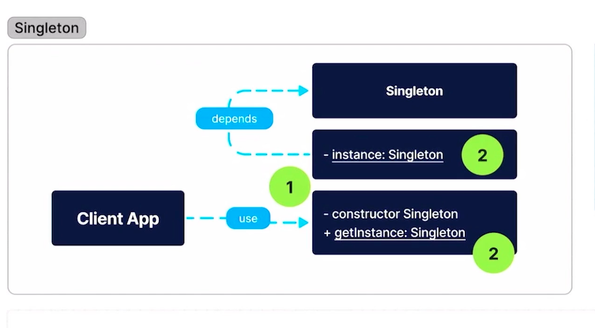

## Clase 02 : Patrones creacionales

Estos patrones abstraen el proceso de creacion de objectos , las tecnicas nos ayuda a la creacion de nuevos objeccto usando el proceso de reutilizacion y extensible , existe relacion entre los 5.

    1. Singleton
    2. Factory
    3. Abstract factory
    4. Builder
    5. Protype

## Clase 03 : Singleton

- En un patron que nos permite asegurarnos que no se pueda crear mas de una instancia de un objeto.
- Con esto aseguramos un único punto global de acceso a la instancia.
- Este también tiene elementos por los que podría ser conocido como un anti-patrón.

### ¿A que problemáticas podría dar solución?

    Cuando queremos asegurar el acceso a un recurso compartido en diferentes partes de la app.

    Suena similar a lo que hace una Biblioteca de Manejo de Estados (Como Vuex, Redux, o NgRx)

    Cuando queremos que la modificación al recurso compartido se lleve a cabo en un solo punto de acceso.

    Un ejemplo para ello seria crear un método en la clase, donde se pueda modificar el estado interno de ese único objeto.

### Solución

    El patron sugiere hacer privado el constructor de la clase para evitar hacer uso del operador new().
    Crear un método estático que actué como “constructor” y que tras bambalina llame al constructor privado, para crear un objeto que estará guardado en una variable estática que funcionara como caché.

## Clase 04 : Implmentacion - Singleton



```js
class Singleton {
  static instance = undefined; //Atributo estático para almacenar el valor, llamado para la validación de getInstance()

  constructor(version) {
    this.version = version;
  }

  static getInstance(version) {
    //Si no existe el atributo instance...
    if (!Singleton.instance) {
      Singleton.instance = new Singleton(version); //...lo crea.
    }
    return Singleton.instance;
  }
}

function appSingleton() {
  //Todas las variables tienen la misma referencia al mismo objeto. 1 sola instancia a lo largo de la aplicación:
  const singleton1 = Singleton.getInstance("version-1");
  const singleton2 = Singleton.getInstance("version-2");
  const singleton3 = Singleton.getInstance("version-3");

  console.log(singleton1 === singleton2); //true
  console.log(singleton1 === singleton3); //true
}
appSingleton();
```

## Clase 05 : Contrastemos: Singleton con TS

es mas estricto

```js
interface Singleton {
    instance: Singleton
    version: string
    getInstance(version: Singleton['version']): Singleton
}

class Singleton implements Singleton {
    private static instance: Singleton | undefined = undefined

    public version: string

    private constructor(version: string) {
        this.version = version
    }

    public static getInstance(version: string): Singleton {
        if(!Singleton.instance) Singleton.instance = new Singleton(version)

        return Singleton.instance
    }
}

function appSingleton() {
    const singleton1 = Singleton.getInstance('1')
    const singleton2 = Singleton.getInstance('2')
    const singleton3 = Singleton.getInstance('3')

    console.log(`singleton1 es igual a singleton2? : ${singleton1 === singleton2}`)
    console.log(`singleton2 es igual a singleton3? : ${singleton2 === singleton3}`)
}

appSingleton()
```

## Clase 06 : Pros y Contras

Pros.

- 1. Certeza.
- 2. Solo un acceso global.
- 3. Solo una llamada una instancia

Contras

-
- tiene una complejidad de pruebas unitarias

Usuarlo

- Manejo del estado en aplicacion ,
-
