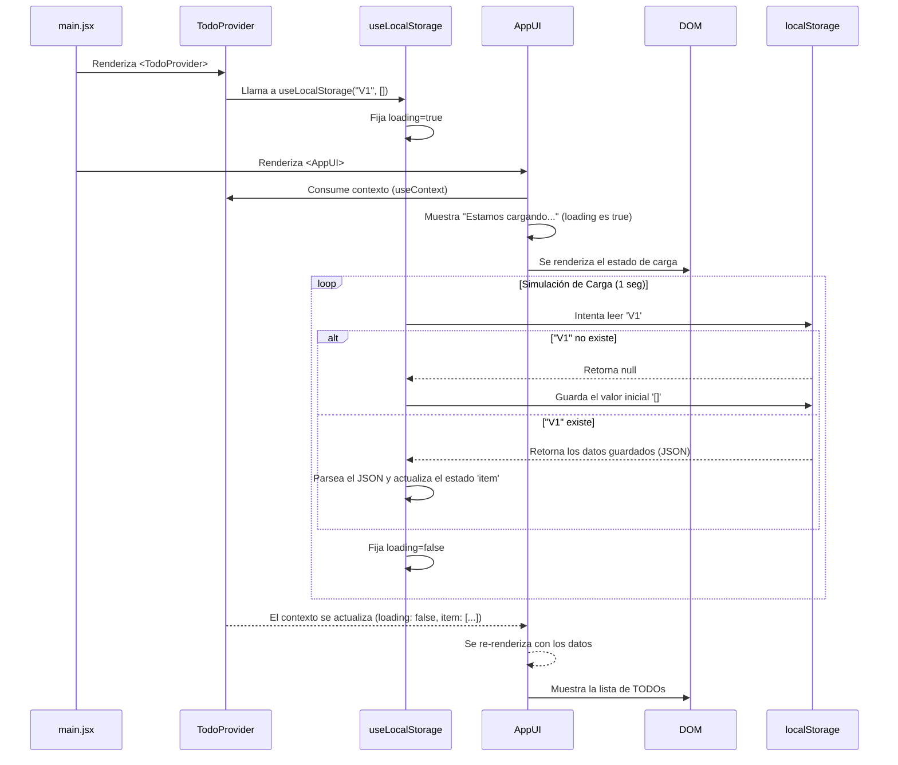
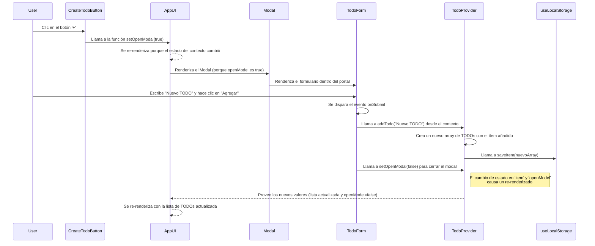
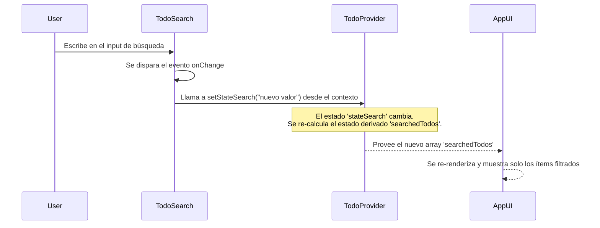
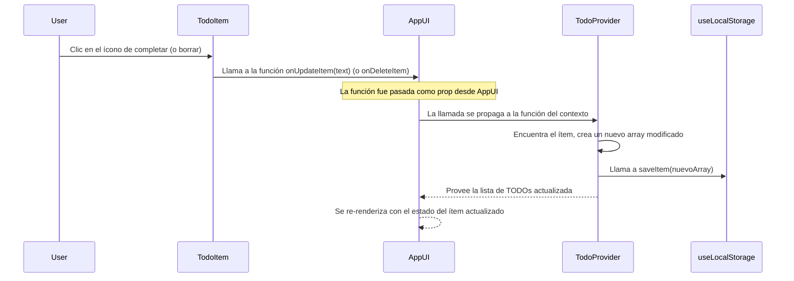

# Diagrama de Flujo de Datos y Renderizado - App de TODOs

Este documento describe cómo fluyen los datos a través de tu aplicación React, desde la interacción del usuario hasta la actualización de la interfaz. Usamos diagramas de secuencia para ilustrar las interacciones entre componentes y funciones.

## 1. Carga Inicial de la Aplicación

Este es el flujo cuando un usuario abre la aplicación por primera vez.

### Explicación Paso a Paso:
1.  **Inicio (`main.jsx`):** La aplicación se monta. `TodoProvider` envuelve a `AppUI`.
2.  **`TodoProvider` se activa:**
    *   Llama al hook `useLocalStorage`.
    *   `useLocalStorage` establece su estado interno a `loading: true`.
3.  **Primer Render (`AppUI`):**
    *   `AppUI` consume el contexto (`useContext(TodoContext)`). En este momento, obtiene `loading: true`.
    *   El renderizado condicional muestra el mensaje "Estamos cargando".
4.  **Efecto de `useLocalStorage`:**
    *   Dentro de `useEffect`, se ejecuta un `setTimeout` de 1 segundo para simular la carga.
    *   Pasado el tiempo, intenta leer los datos desde `localStorage` con la clave "V1".
    *   Si no hay datos, guarda un array vacío `[]`. Si los hay, los parsea y los carga en su estado `item`.
    *   Finalmente, actualiza su estado interno a `loading: false`.
5.  **Segundo Render (Re-renderizado):**
    *   El cambio de estado en `useLocalStorage` provoca que el componente `TodoProvider` se re-renderice.
    *   `TodoProvider` ahora pasa los nuevos valores (`loading: false` y la lista de `todos`) a través del contexto.
    *   `AppUI`, al estar suscrito al contexto, detecta el cambio y se re-renderiza.
    *   Ahora `loading` es `false` y `searchedTodos` tiene datos, por lo que se muestra la lista de `TodoItem`.

---

## 2. Añadir un Nuevo TODO

Este es el flujo cuando un usuario crea un nuevo TODO.

### Explicación Paso a Paso:
1.  **Abrir el Modal:**
    *   El usuario hace clic en `CreateTodoButton`.
    *   El botón llama a la función `setOpenModal(true)`, que fue pasada desde `AppUI` y que a su vez viene del `TodoContext`.
    *   El estado `openModel` en `TodoProvider` cambia a `true`.
    *   `AppUI` se re-renderiza y, como `openModel` es `true`, ahora renderiza el componente `Modal`.
    *   El `Modal` usa un portal para renderizar `TodoForm` en el `
`.
2.  **Enviar el Formulario:**
    *   El usuario escribe en el `textarea` y hace clic en "Agregar".
    *   Se activa el evento `onSubmit` en `TodoForm`.
    *   La función `onSubmit` llama a `addTodo(newTodoValue)` (obtenida del contexto).
3.  **Actualizar el Estado:**
    *   La función `addTodo` en `TodoProvider` crea una copia del array de `todos`, añade el nuevo y llama a `saveItem(nuevoArray)`.
    *   `saveItem` (dentro de `useLocalStorage`) guarda el nuevo array en `localStorage` y actualiza el estado `item`.
4.  **Cerrar el Modal y Re-renderizar:**
    *   Después de llamar a `addTodo`, la función `onSubmit` en `TodoForm` también llama a `setOpenModal(false)`.
    *   Los estados `item` y `openModel` han cambiado en `TodoProvider`.
    *   `AppUI` se re-renderiza, ahora mostrando la lista actualizada y con el modal cerrado.

---

## 3. Filtrar (Buscar) TODOs

Este es el flujo cuando un usuario escribe en la barra de búsqueda.

### Explicación Paso a Paso:
1.  **Interacción del Usuario:** El usuario escribe en el `input` del componente `TodoSearch`.
2.  **Evento `onChange`:**
    *   Se dispara el manejador de eventos `onSearchValueChange`.
    *   Este llama a `setStateSearch(e.target.value)`, función obtenida del `TodoContext`.
3.  **Actualización de Estado y Estado Derivado:**
    *   El estado `stateSearch` dentro de `TodoProvider` se actualiza.
    *   `TodoProvider` se re-renderiza. En este nuevo render, la variable `searchedTodos` se **re-calcula**. Ya no es el array completo, sino el resultado de filtrar `data` con el nuevo valor de `stateSearch`.
4.  **Re-renderizado de la UI:**
    *   El nuevo array `searchedTodos` se pasa a través del `value` del Provider.
    *   `AppUI` se re-renderiza, recibe la nueva lista filtrada y la pasa a `TodoList`, que muestra solo los `TodoItem` que coinciden con la búsqueda.

---

## 4. Completar o Borrar un TODO

Ambos flujos son muy similares.

### Explicación Paso a Paso:
1.  **Interacción del Usuario:** El usuario hace clic en el ícono de "completar" o "borrar" de un `TodoItem`.
2.  **Propagación del Evento (Hijo a Padre):**
    *   El `onClick` del `` en `TodoItem` llama a la función que recibió como `prop` (`onUpdateItem` o `onDeleteItem`).
    *   Esta función fue definida en `AppUI` y pasada como prop. En `AppUI`, la función simplemente llama a la versión que viene del contexto, pasándole el `text` del ítem.
3.  **Actualización del Estado Central:**
    *   La función `onUpdateItem` (o `onDeleteItem`) en `TodoProvider` se ejecuta.
    *   Crea una copia del array de `todos`, busca el ítem por su `text`, lo modifica (o elimina), y llama a `saveItem(nuevoArray)`.
4.  **Re-renderizado Final:**
    *   `saveItem` actualiza el estado `item` en `useLocalStorage`.
    *   Esto causa el re-renderizado de `TodoProvider` y, consecuentemente, de `AppUI` y la lista, reflejando el cambio (el ítem aparece tachado o desaparece).
