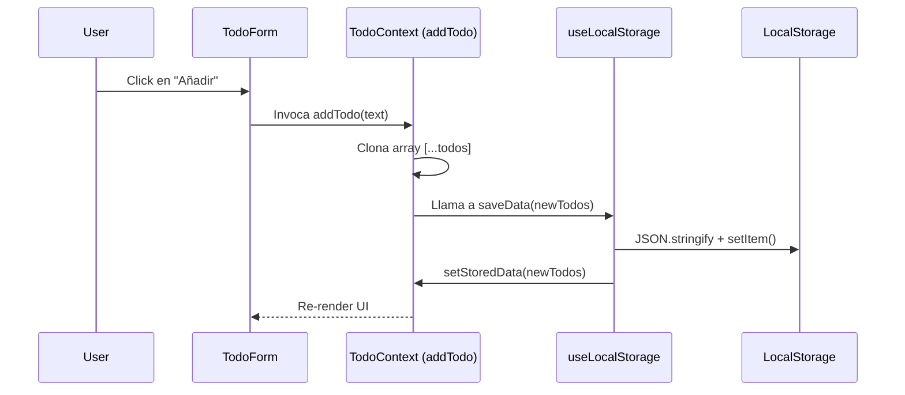

# DOCUMENTACIÓN TÉCNICA DETALLADA: REACT TODO SYSTEM
## Arquitectura de Software y Especificación de Ingeniería

---

### CAPÍTULO 1: ARQUITECTURA DEL SISTEMA (REACT 18 + VITE)

El sistema se basa en una arquitectura funcional desacoplada. El punto de entrada `main.jsx` inicializa el entorno mediante `React.createRoot`, inyectando una capa de orquestación de estado global antes de la renderización de la interfaz.

**1.1 Stack de Construcción:**
- **Vite:** Motor de desarrollo que utiliza ESM nativos para un HMR (Hot Module Replacement) instantáneo.
- **React 18:** Implementación de concurrencia y transiciones de estado.

**1.2 Jerarquía de Montaje:**
La aplicación sigue el patrón de **Composición de Componentes**. El `TodoProvider` actúa como el nodo raíz lógico, proveyendo un objeto `value` que contiene 12 propiedades (estados y despachadores) a los componentes terminales.

---

### CAPÍTULO 2: GESTIÓN DE ESTADO GLOBAL (CONTEXT API)

El archivo `src/context/customContext.jsx` define el `TodoProvider`. No utiliza Reducers complejos, sino que opta por un patrón de **State Management** basado en Hooks atómicos.

**2.1 Lógica de Búsqueda (Estado Derivado):**
El sistema evita la redundancia de datos mediante el cálculo de estados derivados:
```javascript
const searchedTodos = useMemo(() => {
    if (searchValue.length === 0) return todos;
    return todos.filter((todo) =>
        todo.text.toLowerCase().includes(searchValue.toLowerCase()),
    );
}, [todos, searchValue]);
```
*Análisis Técnico:* La función `filter` crea una proyección del array original. La lógica booleana `includes()` garantiza una búsqueda no sensible a mayúsculas mediante la normalización de cadenas con `toLowerCase()`.

---

### CAPÍTULO 3: CAPA DE PERSISTENCIA (LOCALSTORAGE API)

La persistencia se implementa en `src/hook/useLocalStorage.js` siguiendo el patrón **Adapter**.

**3.1 Sincronización Inmutable:**
La función `saveData` asegura que el almacenamiento físico y el estado de React estén sincronizados de forma idempotente:
```javascript
const saveData = React.useCallback((newData) => {
    try {
        localStorage.setItem(storageKey, JSON.stringify(newData));
        setStoredData(newData);
    } catch (err) {
        setHasError(true);
    }
}, [storageKey]);
```
*Manejo de Ciclo de Vida:* El Hook utiliza un efecto de limpieza (`cleanup`) en el `useEffect` mediante `clearTimeout(timeoutId)` para evitar fugas de memoria si el componente se desmonta antes de la carga inicial de 1 segundo.

---

### CAPÍTULO 4: DICCIONARIO DE COMPONENTES Y FUNCIONES

| Componente | Patrón | Lógica Principal |
| :--- | :--- | :--- |
| `TodoCounter` | Consumer | Muestra `totalTodos` y `completedTodos` del contexto. |
| `TodoSearch` | Controlled Input | Sincroniza el `searchValue` mediante el evento `onChange`. |
| `TodoItem` | Stateless | Recibe `onComplete` y `onDelete` como Props (Callbacks). |
| `Modal` | Portal | Utiliza `ReactDom.createPortal` para renderizar fuera de la jerarquía del DOM. |

---

### CAPÍTULO 5: GUÍA DE ESTILO Y CONVENCIONES JSDoc

El proyecto sigue el estándar de **Documentación Orientada a Intención**.

**5.1 Reglas de Documentación:**
- **@remarks:** Obligatorio para explicar decisiones arquitectónicas (ej: por qué se usa `useMemo`).
- **@param / @returns:** Tipado estricto para facilitar la inferencia en entornos de desarrollo sin TypeScript.

**5.2 Diagrama de Flujo de Datos (Sequence):**


---
**FIN DEL REPORTE TÉCNICO**
