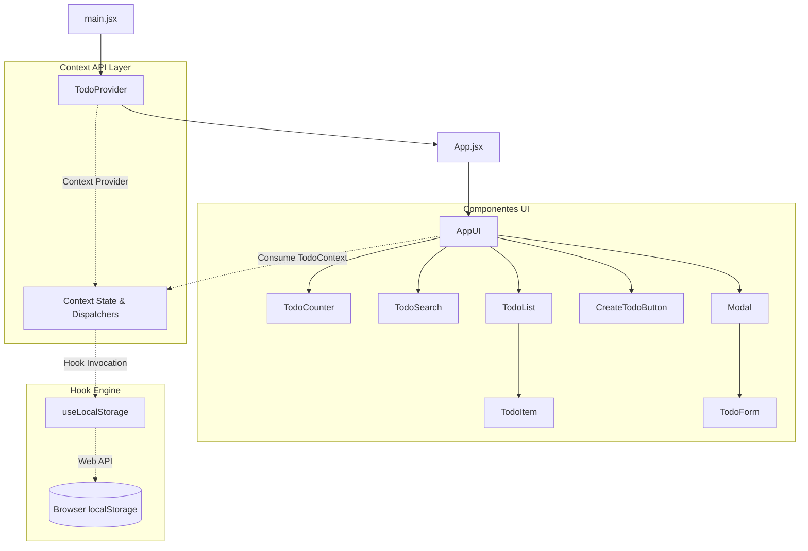
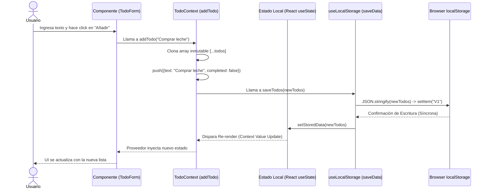
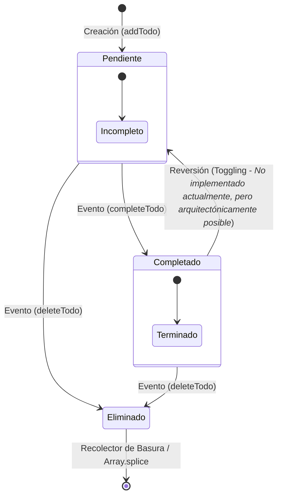

# Technical Design Document (TDD)
## Especificación de Arquitectura de Software
**Proyecto:** React Todo Application
**Fecha:** 15 de abril de 2026
**Rol:** Senior Software Architect

---

## 1. ANÁLISIS DE ARQUITECTURA Y PATRONES

La aplicación sigue un enfoque de diseño **Feature-Based** apoyado fuertemente en **Component Composition** y una capa de abstracción de estado global. La arquitectura evita ser monolítica al desacoplar responsabilidades clave a través de los siguientes patrones de diseño en React:

### 1.1 Identificación de Patrones
*   **Provider Pattern (Context API):** Implementado a través de `TodoProvider`. Se encarga de aislar la "Lógica de Negocio" (estado de los todos, filtrado y acciones CRUD) de la "Capa de Presentación". Este patrón erradica el *prop-drilling* y centraliza la fuente de verdad de la UI.
*   **Custom Hooks (Abstracción de Lógica):** `useLocalStorage` actúa como un adaptador (*Adapter Pattern*) para la persistencia del navegador. Oculta la complejidad de la serialización JSON y simula asincronía (latencia de red) para una mejor UX.
*   **Component Composition:** En lugar de renderizar componentes pesados que gestionan múltiples estados internos, el diseño favorece componentes "tontos" (Dumb Components) envueltos por `AppUI` que inyectan dependencias vía `children`.

---

## 2. DIAGRAMAS UML (MERMAID)

### 2.1 Diagrama de Componentes (Jerarquía y Flujo de Contexto)
El siguiente diagrama ilustra cómo el Árbol de Componentes se nutre desde la raíz a través del Contexto Global.



### 2.2 Diagrama de Secuencia (Flujo de Persistencia)
Este flujo detalla el recorrido sincrónico-reactivo desde que un usuario dispara la creación de un TODO hasta que la capa persistente confirma el almacenamiento.



### 2.3 Diagrama de Estado (Ciclo de Vida de una Tarea)
El ciclo de vida de un ítem TODO en esta arquitectura funcional. El estado es siempre inmutable; las transiciones generan una nueva instancia del objeto y del array.



---

## 3. DOCUMENTACIÓN TÉCNICA DETALLADA

### 3.1 State Management: El Orquestador `TodoContext`
El núcleo orquestador del proyecto reside en `src/context/customContext.jsx`. La decisión de usar la Context API previene que componentes presentacionales como `AppUI` manejen lógica pesada de filtrado.

**Explicación Isométrica del Filtrado Optimizado:**
```javascript
const searchedTodos = useMemo(() => {
    if (searchValue.length === 0) return todos;
    return todos.filter((todo) =>
        todo.text.toLowerCase().includes(searchValue.toLowerCase()),
    );
}, [todos, searchValue]);
```
> **Análisis Lógico:** El uso de `useMemo` aquí es crítico para el rendimiento. Filtrar un array puede ser costoso computacionalmente (complejidad O(N)). Al memoizar este valor, React solo recalculará `searchedTodos` si y solo si la matriz de `todos` muta, o el `searchValue` cambia. Si, por ejemplo, el modal se abre (`isModalOpen` cambia), este bloque no se re-ejecutará, ahorrando ciclos de CPU.

### 3.2 Hook Engine & Persistence: `useLocalStorage`
Este hook encapsula una complejidad significativa: la sincronización entre el estado reactivo en memoria (React DOM) y un motor de almacenamiento de clave-valor externo (`localStorage`).

**Explicación Isométrica de la Sincronización:**
```javascript
const saveData = React.useCallback((newData) => {
    try {
        localStorage.setItem(storageKey, JSON.stringify(newData));
        setStoredData(newData);
    } catch (err) {
        setHasError(true);
        console.error(`Error al guardar en la clave "${storageKey}":`, err);
    }
}, [storageKey]);
```
> **Análisis Lógico:** La función de persistencia asegura **Idempotencia** (aplicar el mismo estado varias veces producirá el mismo resultado en memoria y almacenamiento). El uso del bloque `try-catch` es un estándar de alta ingeniería: `localStorage` puede fallar si el navegador está en modo incógnito estricto o si se excede la cuota de memoria (aprox. 5MB). Si ocurre un fallo, el estado reactivo no se ensucia gracias a que `setStoredData` está supeditado al éxito del `setItem` anterior. El uso de `useCallback` previene re-renderizados innecesarios en el Provider si `saveData` se pasa como dependencia a otros hooks.

---

## 4. GLOSARIO TÉCNICO Y MEJORES PRÁCTICAS

### 4.1 Glosario Arquitectónico
*   **Estado Inmutable:** Principio de React donde el estado nunca se modifica directamente (ej. `todos[0].completed = true` es un antipatrón sin antes clonar). En su lugar, se clona la estructura subyacente (`[...todos]`) y se pasa a la función de actualización (`setState`).
*   **Idempotencia:** La capacidad de una función o componente de producir el mismo resultado y estado del sistema independientemente de cuántas veces se invoque con los mismos parámetros.
*   **Serialización (JSON.stringify):** El proceso de convertir estructuras de datos complejas en memoria (arrays de objetos) en un formato de cadena plana transmisible o almacenable.
*   **Prop-Drilling:** Antipatrón en React donde las propiedades se pasan por muchos niveles de la jerarquía de componentes a través de componentes que no necesitan esos datos, resuelto mediante el Provider Pattern.

### 4.2 Evaluación de Mejores Prácticas (JSDoc)
Actualmente, el proyecto muestra una implementación fundamental de JSDoc.

**Evaluación:**
El uso de etiquetas como `@file`, `@description`, `@param` y `@returns` es robusto, brindando tipado inferido para el servidor de lenguaje del IDE (TypeScript Language Server funcionando en archivos `.js/.jsx`). La inclusión de la etiqueta `@remarks` es una excelente práctica arquitectónica.

**Sugerencias de Mejora Estratégica:**
1.  **Tipado de Modelos:** Centralizar la estructura de un "Todo" usando `@typedef`. Actualmente, los componentes asumen la forma del objeto.
    ```javascript
    /**
     * @typedef {Object} TodoItemModel
     * @property {string} text - El contenido descriptivo inmutable del Todo.
     * @property {boolean} completed - Estado del ciclo de vida de la tarea.
     */
    ```
2.  **Explicar el "POR QUÉ" en JSDoc:** Modificar comentarios como `"Filtra la lista de TODOs basándose en el valor del input de búsqueda"` por `"Genera una lista memoizada de TODOs derivados para prevenir costosos re-renderizados del componente TodoList durante transiciones de estado no relacionadas (ej. Toggle Modal)."`. Esto alinea el código con la filosofía de ingeniería estipulada en el proyecto.
