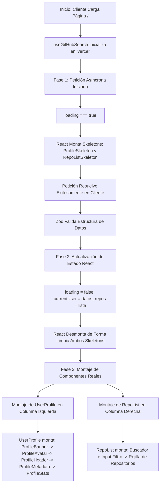

# 🌌 GitHub API Explorer & Developer Finder (Premium Dual-Theme & iPhone-Optimized)

Un explorador y buscador ultra-premium de perfiles de GitHub desarrollado con tecnologías a la vanguardia de la ingeniería frontend: **Next.js 16 (React 19)**, **TypeScript**, **Tailwind CSS v4** (con diseño adaptativo de variables fluidas) y validación estricta de esquemas de datos con **Zod**. 

El proyecto implementa un sistema desacoplado de temas visuales (**Tema Claro / Tema Oscuro**) e interfaces móviles responsivas optimizadas al 100% para pantallas estrechas, ajustadas minuciosamente para **iPhone 13, 14, 15 y 16** (viewports de 375px a 430px).

---

## 🎨 Arquitectura de Temas Visuales (Claro y Oscuro)

El dashboard cuenta con una alternancia dinámica de temas que redefine la estética del diseño web moderno con efectos translúcidos y micro-animaciones:

*   **Tema Oscuro (Por Defecto)**: Una atmósfera sofisticada tipo cyberpunk y ciencia ficción, caracterizada por fondos profundos `#06050b`, mallas radiales vibrantes en tonos cian y violeta, y rejillas técnicas semi-transparentes de fondo.
*   **Tema Claro**: Una interfaz fresca de alta gama inspirada en la filosofía *glassmorphism* que aprovecha un fondo suave `#faf9fd`, contrastes tipográficos en tonos pizarra (`slate-900` / `slate-700`) y resplandores degradados de opacidad reducida.
*   **Inyección Dinámica a Nivel Raíz**: La selección de tema se realiza inyectando la clase `.light` o `.dark` en el nodo raíz de HTML (`document.documentElement`), propagando instantáneamente los cambios en todas las variables CSS.
*   **Inicialización Segura & Evitación de Parpadeo (Flicker)**: El botón flotante de control lee la caché en `localStorage` o infiere la preferencia nativa del OS (`matchMedia`). Además, inicializa el estado del cliente a través de un callback asíncrono con `requestAnimationFrame`, resolviendo cualquier conflicto de hidratación (hydration mismatch) o renders en cascada y garantizando cero saltos acumulativos de diseño (**CLS**).

---

## 📱 Optimización Móvil & Mobile-First (iPhone 13 - 16)

*   **Ajustes Rigurosos de Viewport**: Adaptado perfectamente para un ancho mínimo de 375px (iPhone SE/13 mini) hasta un ancho máximo sin estirar de 430px (iPhone 14/15/16 Pro Max).
*   **Paddings y Elementos Compactos**: Distribución fluida de márgenes que aprovecha al máximo cada píxel móvil.
*   **Cuadrícula Adaptable de 2 Columnas**: Los paneles de filtrado por nombre y el menú desplegable de selección de lenguajes se re-organizan dinámicamente en una cuadrícula compacta de dos columnas en móvil, manteniéndose legibles y alineados.
*   **Truncado Inteligente**: Implementa un sistema preventivo de truncado (`truncate` y `line-clamp-2`) para enlaces web, ubicaciones, nombres de compañías y biografías de usuario, evitando desbordes horizontales accidentales.

---

## 🔄 Ciclo de Vida y Flujo de Montaje de Componentes

A continuación se detalla cronológicamente cómo se inicializa, monta, actualiza y desmonta cada componente en el ciclo de renderizado de React 19:



### 1. Inicialización y Montaje Inicial (First Mount)
*   Next.js renderiza el contenedor principal `<GitHubSearchDashboard />` en [index.tsx](file:///C:/Users/slinkter/Documents/GitHub/Frontend/R04.Typescript/typescript01/features/github-search/index.tsx).
*   Se ejecuta el hook personalizado `useGitHubSearch`, configurado con el valor inicial `"vercel"`.
*   El hook activa un `useEffect` que inicia la solicitud asíncrona a la API de GitHub. Al mismo tiempo, el estado `loading` cambia a `true`.
*   React detecta el estado `loading` activo y monta los componentes condicionales: `ProfileSkeleton` y `RepoListSkeleton`. Los skeletons comienzan su animación de pulso infinito (`animate-pulse`) en el DOM real.

### 2. Resolución de Datos y Validación
*   La llamada Fetch de la API finaliza con éxito.
*   Se validan los datos utilizando los esquemas de **Zod**: `GitHubUserSchema` y `GitHubRepoListSchema`.
*   Se actualizan los estados locales de React con los datos limpios: `currentUser` y `repos`.
*   El estado `loading` se establece en `false`.

### 3. Reconciliación del DOM Virtual y Desmontaje (Unmounting)
*   React ejecuta una nueva fase de renderizado.
*   Al evaluar que `loading` ahora es `false`, React determina que los skeletons ya no deben estar en pantalla.
*   Los componentes `ProfileSkeleton` y `RepoListSkeleton` son desmontados de manera limpia del DOM real, liberando la memoria consumida.

### 4. Montaje Concurrentes del Dashboard Real (Successful Render)
*   React monta en paralelo el visualizador interactivo de repositorios `<RepoList />` y la tarjeta del perfil `<UserProfile />`.
*   **UserProfile** actúa como un contenedor desacoplado que monta progresivamente sus sub-módulos visuales internos:
    1.  `ProfileBanner`: Renderiza el fondo geométrico con gradientes adaptativos.
    2.  `ProfileAvatar`: Dibuja el avatar del desarrollador con anillos concéntricos interactivos.
    3.  `ProfileHeader`: Renderiza el nombre con gradiente dual de texto, el enlace de external-link animado y la burbuja de biografía.
    4.  `ProfileMetadataItem`: Carga en filas modulares cada dato disponible (compañía, Twitter, ubicación, blog) aplicando estilos de cristal.
    5.  `ProfileStats`: Monta la cuadrícula de tres columnas con la interacción del total de repositorios, seguidores y seguidos.
*   **RepoList** renderiza el panel de búsqueda local con un buscador que filtra en tiempo real sobre los nombres y descripciones de los repositorios populares del usuario, junto con un menú de selección exclusivo por lenguaje de programación detectado.

---

## 🛠️ Pila Tecnológica

*   **Framework**: [Next.js 16 (App Router)](https://nextjs.org/) & [React 19](https://react.dev/)
*   **Estilos**: [Tailwind CSS v4](https://tailwindcss.com/) con Glassmorphism y Keyframes avanzados
*   **Validación de Esquemas**: [Zod](https://zod.dev/)
*   **Iconografía**: [Lucide React](https://lucide.dev/)
*   **Gestor de Paquetes**: `pnpm`

---

## 📂 Estructura del Proyecto

El código está organizado bajo el estándar de **Arquitectura Basada en Características (Feature-Based Architecture)**, aislando toda la lógica del dominio:

```
features/
└── github-search/
    ├── api/              # Servicios de consulta y esquemas Zod (githubSchema.ts, githubService.ts)
    ├── components/       # Componentes de UI modulares y desacoplados
    │   ├── SearchInput.tsx   # Campo de búsqueda premium con validación Zod al escribir
    │   ├── ThemeToggle.tsx   # Botón de alternancia de temas con requestAnimationFrame
    │   ├── UserProfile.tsx   # Tarjeta de perfil con metadatos y estadísticas responsivas
    │   ├── RepoList.tsx      # Grilla de repos con buscador interactivo y filtros avanzados
    │   └── Skeleton.tsx      # Diseños esqueleto adaptables al tema activo
    ├── hooks/            # useGitHubSearch.ts para la gestión unificada de estados y consultas
    └── index.tsx         # Dashboard integrado unificado (<GitHubSearchDashboard />)
```

---

## 🚀 Instalación y Uso

### 1. Instalar dependencias del proyecto

```bash
pnpm install
```

### 2. Iniciar el servidor local de desarrollo

```bash
pnpm run dev
```

Abre [http://localhost:3000](http://localhost:3000) en tu navegador para interactuar con la aplicación. Se recomienda activar la vista móvil (herramientas de desarrollador) para apreciar los detalles de optimización para iPhone.

### 3. Compilar para producción (Pixel-Perfect Compilation)

```bash
pnpm run build
```

Este comando valida estrictamente el tipado con TypeScript y emite los recursos de producción altamente optimizados.

---

## 🔍 Verificaciones y Linter

El proyecto cumple con estrictas pautas de calidad:
*   **Análisis Estático (Linter)**: `pnpm run lint` (0 errores de código encontrados).
*   **Tipado Riguroso**: Compilación TypeScript de extremo a extremo sin el uso de `@ts-ignore` ni `any` inseguros.
