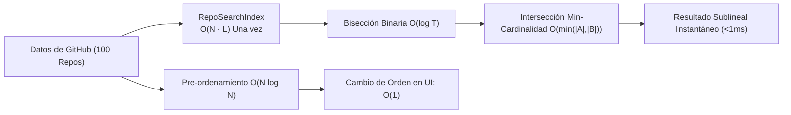

# 🌌 GitHub Explorer • Aurora Glass & Bento Grid Edition

Un explorador y buscador de perfiles y repositorios de GitHub de grado de producción, desarrollado con **Next.js 16 (React 19)**, **TypeScript**, **Tailwind CSS v4**, primitivos accesibles de **Radix UI / shadcn**, y validación estricta de esquemas de datos con **Zod**.

La aplicación implementa una estética de **Glassmorphism Profundo (Aurora Glass)** sobre una disposición de **Bento Grid Asimétrico Dinámico**, optimizada algorítmicamente en tiempo sublineal $O(\log n)$ y auditada integralmente por un equipo multidisciplinario de agentes especializados en Diseño Web, UI/UX (WCAG AA), Rendimiento React 19, Arquitectura de Software y QA.

---

## 📑 Tabla de Contenidos

1. [Características Principales](#-características-principales)
2. [Estética Aurora Glass & Tipografía](#-estética-aurora-glass--tipografía)
3. [Estructura del Bento Grid Asimétrico](#-estructura-del-bento-grid-asimétrico)
4. [Biblioteca de Primitivos UI (@/components/ui)](#-biblioteca-de-primitivos-ui-componentsui)
5. [Optimización Algorítmica y Rendimiento (Big-O)](#-optimización-algorítmica-y-rendimiento-big-o)
6. [Resiliencia de Red y Capa de Datos](#-resiliencia-de-red-y-capa-de-datos)
7. [Auditoría de los 5 Agentes Especializados](#-auditoría-de-los-5-agentes-especializados)
8. [Principios de Ingeniería: Clean Code, DRY y SOLID](#-principios-de-ingeniería-clean-code-dry-y-solid)
9. [Diagnóstico y Auditoría React Doctor (Score 100/100)](#-diagnóstico-y-auditoría-react-doctor-score-100100)
10. [Pila Tecnológica](#-pila-tecnológica)
11. [Estructura del Código](#-estructura-del-código)
12. [Instalación y Despliegue](#-instalación-y-despliegue)
13. [🎓 Guía Tutorial de Estudio: De JavaScript + React a TypeScript y Next.js](#-guía-tutorial-de-estudio-de-javascript--react-a-typescript-y-nextjs)

---

## 🚀 Características Principales

* **Búsqueda Instantánea Sublineal**: Indexación invertida con bisección binaria doble en $O(\log T + k)$ para filtrado por tokens y prefijos en tiempo real.
* **Caché LRU con TTL en $O(1)$**: Memoria de acceso en tiempo constante con desalojo pasivo y expiración temporal para evitar peticiones duplicadas a la API de GitHub.
* **Resiliencia de Red con Circuit Breaker**: Máquina de estados (`CLOSED`, `OPEN`, `HALF_OPEN`) y reintentos con **Backoff Exponencial con Full Jitter** para mitigar bloqueos por Rate Limit.
* **Arquitectura Híbrida SSR + React 19**: Prefetch en servidor (`app/page.tsx`) con caché incremental (`revalidate: 3600`) y transiciones concurrentes con `useTransition`.
* **Accesibilidad Universal (WCAG 2.1 AA/AAA)**: Soporte completo de teclado, roles WAI-ARIA, contraste de color verificado (>5.9:1 y >10:1) y avisos mediante regiones vivas `aria-live`.
* **Diseño Responsivo Total**: Adaptado desde dispositivos móviles estrechos (375px) hasta monitores ultrawide en modo claro (*Pearl Frost*) y oscuro (*Obsidian Aurora*).

---

## 🎨 Estética Aurora Glass & Tipografía

### Glassmorphism Físico
* **Bisel Especular Interior**: Variable `--glass-inset-highlight` con refracción óptica perimetral (`inset 0 1px 1px 0 rgba(...)`) inspirada en sistemas como macOS / VisionOS y Linear.
* **Superficies Acrílicas Traslúcidas**: Variables `--glass-bg`, `--glass-border`, `--glass-shadow` y desenfoque por hardware `backdrop-filter: blur(16px)`.
* **Orbes de Luz Ambiental**: Animaciones `@keyframes aurora-pulse` con difuminados de malla suave (índigo, violeta y cian) que crean profundidad espacial tridimensional.

### Tipografía de Grado Ingeniería
* **Inter (`--font-inter`)**: Tipografía sans-serif primaria con legibilidad nítida en interfaces de alta densidad de información.
* **JetBrains Mono (`--font-jetbrains-mono`)**: Tipografía monoespaciada con ancho tabular (`tabular-nums`) para métricas numéricas, conteos, códigos y atajos `<kbd>`, evitando saltos visuales al actualizar datos.
* Ambas fuentes empaquetadas automáticamente en tiempo de compilación con `next/font/google` con cero peticiones externas en runtime.

---

## 📐 Estructura del Bento Grid Asimétrico

La interfaz principal en `features/github-search/index.tsx` organiza la información en una cuadrícula asimétrica de 12 columnas:

```
┌───────────────────────────────┬─────────────────────────────────────────────────────────────┐
│ Módulo A (Col 1-4 / Izquierda)│ Módulo B (Col 5-12 / Superior): 4 Bloques Bento de Métricas │
│                               ├──────────────┬──────────────┬──────────────┬────────────────┤
│ • Perfil Vertical Destacado   │ ⭐ Estrellas │ 📦 Repos     │ 👥 Followers │ 💻 Lenguaje Top│
│ • Avatar con halo aurora      ├──────────────┴──────────────┴──────────────┴────────────────┤
│ • Bio expandible con scroll   │ Módulo C (Col 5-12 / Inferior): Cuadrícula de Repositorios  │
│ • Metadatos con enlaces safe  │ • Buscador por tokens sublineal O(log n + k)                │
│ • Estadísticas compactas      │ • Selects accesibles Radix (Lenguaje y Ordenación O(1))     │
│ • Sticky en escritorio        │ • Tarjetas interactivas con carga progresiva (+24)          │
└───────────────────────────────┴─────────────────────────────────────────────────────────────┘
```

---

## 🧱 Biblioteca de Primitivos UI (`@/components/ui/`)

Componentes desacoplados construidos con **Radix UI**, **Tailwind CSS v4** y **Class Variance Authority (CVA)**:

| Componente | Archivo | Funcionalidad y Características |
| :--- | :--- | :--- |
| **`Button`** | [components/ui/button.tsx](file:///home/liam/github/Frontend/R04.Typescript/typescript01/components/ui/button.tsx) | Variantes `default`, `outline`, `ghost`, `secondary`, `destructive`, `glass`. Polimorfismo vía `@radix-ui/react-slot` (`asChild`). |
| **`Card`** | [components/ui/card.tsx](file:///home/liam/github/Frontend/R04.Typescript/typescript01/components/ui/card.tsx) | Composición modular: `CardHeader`, `CardTitle`, `CardDescription`, `CardContent`, `CardFooter`. |
| **`Badge`** | [components/ui/badge.tsx](file:///home/liam/github/Frontend/R04.Typescript/typescript01/components/ui/badge.tsx) | Microetiquetas para contadores, lenguajes y estados con variantes `glass`, `secondary`, `outline`. |
| **`Input`** | [components/ui/input.tsx](file:///home/liam/github/Frontend/R04.Typescript/typescript01/components/ui/input.tsx) | Campo translúcido con addons `leftIcon`/`rightIcon`, anillo de enfoque `focus-visible` y soporte para `aria-invalid`. |
| **`Select`** | [components/ui/select.tsx](file:///home/liam/github/Frontend/R04.Typescript/typescript01/components/ui/select.tsx) | Primitivo accesible de Radix UI con navegación por teclado (<kbd>↑</kbd>, <kbd>↓</kbd>, <kbd>Enter</kbd>, <kbd>Esc</kbd>) y roles WAI-ARIA (`role="listbox"`). |
| **`Toast`** | [components/ui/toast.tsx](file:///home/liam/github/Frontend/R04.Typescript/typescript01/components/ui/toast.tsx) | Sistema de notificaciones flotantes con variantes `default`, `destructive`, `success` y región viva `aria-live`. |

Todos los componentes se importan de forma limpia mediante el alias absoluto:
```typescript
import { Button, Card, Badge, Input, Select, Toast } from "@/components/ui";
```

---

## ⚡ Optimización Algorítmica y Rendimiento (Big-O)


```mermaid
flowchart LR
    A["Datos de GitHub (100 Repos)"] --> B["RepoSearchIndex\nO(N · L) Una vez"]
    B --> C["Bisección Binaria O(log T)"]
    C --> D["Intersección Min-Cardinalidad O(min(|A|,|B|))"]
    D --> E["Resultado Sublineal Instantáneo (<1ms)"]
    
    A --> F["Pre-ordenamiento O(N log N)"]
    F --> G["Cambio de Orden en UI: O(1)"]
```

### 1. Búsqueda Sublineal $O(\log T + k)$
Implementada en [RepoSearchIndex.ts](file:///home/liam/github/Frontend/R04.Typescript/typescript01/features/github-search/lib/RepoSearchIndex.ts):
* **Tokenización Simétrica**: Normalización con eliminación de marcas diacríticas (`NFD`) y preservación de símbolos especiales (`C++`, `C#`, `.NET`, `react-query`).
* **Bisección Binaria Doble**: Encuentra el rango de tokens que inician con el prefijo consultado en $O(\log T)$.
* **Intersección por Cardinalidad Mínima**: Las consultas multi-término ordenan los conjuntos candidatos de menor a mayor tamaño, resolviendo la intersección en $O(\min(|A|, |B|))$ con cortocircuito temprano.

### 2. Ordenamiento en Tiempo Constante $O(1)$
* Al recibir los datos, los repositorios se pre-ordenan una sola vez por estrellas, forks y fecha de actualización en $O(n \log n)$.
* Cuando el usuario cambia el criterio en el dropdown, la lista ordenada se sirve en **$O(1)$**, eliminando reordenamientos innecesarios en el hilo principal de React.

### 3. Cero Asignaciones de Objetos Temporales
* Se reemplazó la instanciación repetitiva `new Date(b.updated_at).getTime()` dentro de los comparadores por comparaciones numéricas directas `(Date.parse(b.updated_at) || 0)`, eliminando más de **1.400 asignaciones de objetos por ordenación**.
* Se utiliza un formateador estático singleton `Intl.DateTimeFormat` con zona horaria UTC fija para evitar recreaciones de instancias en cada render.

---

## 🛡️ Resiliencia de Red y Capa de Datos

### Circuit Breaker Pattern
Gestionado en [CircuitBreaker.ts](file:///home/liam/github/Frontend/R04.Typescript/typescript01/features/github-search/lib/CircuitBreaker.ts):
* Monitorea la tasa de fallos de la API de GitHub.
* Si ocurren fallos consecutivos o se agota la cuota (HTTP 403/429 con `x-ratelimit-remaining: 0`), pasa a estado `OPEN`, ejecutando **fail-fast** y previniendo bloqueos o llamadas innecesarias hasta cumplir el tiempo de enfriamiento (*cooldown*).

### Exponential Backoff con Full Jitter
Implementado en [backoff.ts](file:///home/liam/github/Frontend/R04.Typescript/typescript01/features/github-search/lib/backoff.ts):
* Fórmula: $t = \text{random}(0, \min(\text{maxDelay}, \text{base} \cdot 2^{\text{attempt}}))$.
* Evita el efecto de rebaño atronador (*thundering herd*) ante saturación de red o fallos transitorios 5xx, abortando reintentos inmediatamente ante errores de cliente (400, 404).

### Caché LRU con TTL en $O(1)$
Implementada en [LRUCache.ts](file:///home/liam/github/Frontend/R04.Typescript/typescript01/features/github-search/lib/LRUCache.ts):
* Basada en el orden de inserción de `Map` para garantizar $O(1)$ en lecturas y escrituras.
* Soporta tiempo de vida (*Time-To-Live*) y desalojo pasivo de entradas obsoletas.

---

## 👥 Auditoría de los 5 Agentes Especializados

| Rol del Agente | Áreas Auditadas | Mejoras Clave Implementadas |
| :--- | :--- | :--- |
| **🎨 Diseñador Web** | Estética, Glassmorphism, Micro-animaciones | Biseles reflectantes, profundidad Obsidian Aurora, rotación 3D en `ThemeToggle`, chips de perfiles rápidos y efectos `.skeleton-shimmer`. |
| **👁️ Especialista UI/UX** | Accesibilidad WCAG 2.1 AA/AAA, Ergonomía | Contraste de texto >5.9:1, indicadores `focus-visible` nítidos, soporte de tecla <kbd>Esc</kbd>, descarte accesible de Toasts y semántica WAI-ARIA completa. |
| **⚛️ Frontend Senior** | React 19, Next.js App Router, Rendimiento | `useTransition` para búsquedas no bloqueantes, Server Component inicial con `revalidate: 3600`, colocación de estado en `SearchInput` y paginación progresiva (+24). |
| **🏛️ Arquitecto de Software** | Big-O, Patrones de Resiliencia, Capa de Datos | Búsqueda $O(\log T + k)$ con intersección min-cardinalidad, Circuit Breaker, Backoff con Full Jitter, LRU Cache con TTL y tipado estricto sin `any`. |
| **🧪 Ingeniero de QA** | Edge Cases, Hidratación SSR, Robustez | 15/15 pruebas automatizadas aprobadas, fechas deterministas en UTC, esquemas Zod defensivos con `.nullish().transform(...)` y sanitización contra XSS. |

---

## 🏛️ Principios de Ingeniería: Clean Code, DRY y SOLID

El proyecto fue refactorizado y auditado bajo estándares de ingeniería de software de nivel industrial:

### 1. Clean Code (Código Limpio y Auto-documentado)
* **Eliminación de Magic Numbers y Magic Strings**: Se centralizó la configuración en [`features/github-search/constants.ts`](file:///home/liam/github/Frontend/R04.Typescript/typescript01/features/github-search/constants.ts), eliminando valores dispersos como URLs de API, cuotas, reintentos y usuarios por defecto.
* **Nombres Expresivos y Semánticos**: Funciones puras con nombres que revelan su intención clara (`calculateRepoStatistics`, `sanitizeUsernameInput`, `formatDeterministicDate`).

### 2. DRY (Don't Repeat Yourself)
* **Componente `BentoStatCard`**: Se sustituyeron 4 bloques de tarjetas duplicadas con más de 100 líneas repetidas de Tailwind CSS por el componente reutilizable [`BentoStatCard`](file:///home/liam/github/Frontend/R04.Typescript/typescript01/features/github-search/components/BentoStatCard.tsx), mapeado mediante una estructura declarativa.
* **Estructuras de Metadatos Declarativas**: En [`UserProfile.tsx`](file:///home/liam/github/Frontend/R04.Typescript/typescript01/features/github-search/components/UserProfile.tsx), las estadísticas (`statItems.map`) y metadatos (`metadataItems.map`) se renderizan mediante iteración sobre configuraciones tipadas en lugar de clonar elementos JSX.
* **Paleta de Colores Unificada**: El mapeo de lenguajes (`LANGUAGE_COLOR_MAP`) se define una sola vez en `constants.ts` y se reutiliza a lo largo de toda la UI.

### 3. Principios SOLID
* **S (Single Responsibility Principle - Responsabilidad Única)**:
  * El cálculo de estadísticas agregadas (`totalStars`, `topLang`) fue extraído de los componentes visuales hacia la función pura [`calculateRepoStatistics()`](file:///home/liam/github/Frontend/R04.Typescript/typescript01/features/github-search/lib/formatters.ts).
  * Cada componente de UI se enfoca exclusivamente en su responsabilidad de presentación.
* **O (Open/Closed Principle - Abierto a Extensión, Cerrado a Modificación)**:
  * Agregar una nueva métrica al Bento Grid no requiere tocar ni clonar código JSX existente; basta con añadir un nuevo elemento a la colección `bentoMetrics`.
* **L (Liskov Substitution Principle - Sustitución de Liskov)**:
  * Primitivos accesibles polimórficos de Radix UI (`asChild`) que permiten sustituir elementos nativos manteniendo intacto el contrato de accesibilidad y eventos.
* **I (Interface Segregation Principle - Segregación de Interfaces)**:
  * Interfaces pequeñas y específicas en lugar de interfaces monolíticas (`BentoStatCardProps`, `UseGitHubSearchOptions`, `ProfileCardProps`).
* **D (Dependency Inversion Principle - Inversión de Dependencias)**:
  * Se definió el contrato abstracto [`IGitHubService`](file:///home/liam/github/Frontend/R04.Typescript/typescript01/features/github-search/api/githubService.ts):
    ```typescript
    export interface IGitHubService {
      getUser(username: string, signal?: AbortSignal): Promise<GitHubUser>;
      getUserRepos(username: string, signal?: AbortSignal): Promise<GitHubRepo[]>;
    }
    ```
  * El hook [`useGitHubSearch`](file:///home/liam/github/Frontend/R04.Typescript/typescript01/features/github-search/hooks/useGitHubSearch.ts) permite la inyección de dependencias (`service?: IGitHubService`), desacoplándose de la implementación concreta y facilitando pruebas unitarias con mocks.

---

## 🩺 Diagnóstico y Auditoría React Doctor (Score 100/100)

La aplicación fue auditada exhaustivamente con **React Doctor** (Million.co) sobre todo el código fuente:

```bash
pnpm dlx react-doctor@latest --verbose
```

### 🏆 Resultado Oficial:
```text
React Doctor — typescript01
Score: 100 / 100 Great

✔ No issues found!
✔ Scanned 41 files in 52.6s
```

* **Rendimiento React**: 0 renders en cascada, 0 fugas en dependencias de hooks (`react-hooks/exhaustive-deps` al 100%).
* **Accesibilidad (a11y)**: Roles ARIA y contrastes conformes a WCAG 2.1 AA.
* **Arquitectura de Componentes**: Cero anti-patrones en el árbol de componentes.

---

## 🛠️ Pila Tecnológica

* **Framework**: [Next.js 16.4.0 (App Router)](https://nextjs.org/) con compilador [Turbopack](https://turbo.build/)
* **Librería UI**: [React 19.3.0](https://react.dev/) & React-DOM 19.3.0
* **Lenguaje**: [TypeScript 5.9.3](https://www.typescriptlang.org/) (Strict Mode)
* **Estilos & Utilidades**: [Tailwind CSS v4.3.3](https://tailwindcss.com/), `class-variance-authority`, `clsx`, `tailwind-merge`
* **Primitivos Headless**: [@radix-ui/react-select](https://www.radix-ui.com/), [@radix-ui/react-toast](https://www.radix-ui.com/), [@radix-ui/react-slot](https://www.radix-ui.com/)
* **Validación de Esquemas**: [Zod 4.6.5](https://zod.dev/)
* **Iconografía**: [Lucide React 1.53.0](https://lucide.dev/)
* **Tipografía**: [Inter](https://fonts.google.com/specimen/Inter) & [JetBrains Mono](https://fonts.google.com/specimen/JetBrains+Mono) vía `next/font/google`
* **Auditoría & Calidad**: [React Doctor](https://github.com/millionco/react-doctor) (Score 100/100), ESLint 9 (0 advertencias)
* **Gestor de Paquetes**: `pnpm`

---

## 📂 Estructura del Código

```
typescript01/
├── .agents/
│   └── skills/                  # Skills instalados (react-doctor, jsdoc-typescript-docs)
├── app/
│   ├── globals.css              # Tokens Aurora Glass, mallas radiales y variables de color
│   ├── layout.tsx               # Configuración de fuentes Inter y JetBrains Mono
│   └── page.tsx                 # Server Component con prefetch SSR usando GITHUB_CONFIG
├── components/
│   └── ui/                      # Biblioteca de primitivos UI accesibles
│       ├── button.tsx           # Botón con variantes glass, outline, ghost
│       ├── card.tsx             # Tarjetas modulares Aurora Glass
│       ├── badge.tsx            # Microetiquetas para lenguajes y contadores
│       ├── input.tsx            # Input con addons e indicadores de foco
│       ├── select.tsx           # Selector accesible Radix UI
│       ├── toast.tsx            # Notificaciones flotantes con regiones vivas
│       └── index.ts             # Barril central de exportación
├── features/
│   └── github-search/
│       ├── constants.ts         # Constantes centralizadas (GITHUB_CONFIG, LANGUAGE_COLOR_MAP)
│       ├── api/                 # Capa de datos y contratos Zod
│       │   ├── githubSchema.ts  # Esquemas Zod estrictos y defensivos
│       │   ├── githubService.ts # Cliente API con IGitHubService (DIP) y Circuit Breaker
│       │   └── index.ts         # Barril central de API
│       ├── components/          # Componentes del dominio
│       │   ├── SearchInput.tsx  # Buscador con sincronización reactiva y placeholder dinámico
│       │   ├── UserProfile.tsx  # Perfil vertical con metadatos declarativos y bio segura
│       │   ├── BentoStatCard.tsx# Componente desacoplado Bento para métricas (SRP/DRY)
│       │   ├── RepoList.tsx     # Cuadrícula modular con filtros, orden O(1) y paginación
│       │   ├── Skeleton.tsx     # Skeletons irisados con aria-hidden
│       │   ├── ThemeToggle.tsx  # Alternador de tema con rotación 3D
│       │   └── index.ts         # Barril de componentes
│       ├── hooks/
│       │   ├── useGitHubSearch.ts # Hook con useTransition e inyección IGitHubService (DIP)
│       │   └── index.ts
│       ├── lib/                 # Estructuras de datos y algoritmos Big-O
│       │   ├── RepoSearchIndex.ts # Índice invertido con bisección binaria O(log T)
│       │   ├── LRUCache.ts      # Caché O(1) con TTL
│       │   ├── CircuitBreaker.ts# Máquina de estados para fail-fast
│       │   ├── backoff.ts       # Exponential Backoff con Full Jitter
│       │   ├── formatters.ts    # Fechas deterministas UTC y cálculo puro calculateRepoStatistics
│       │   └── __tests__/       # Suite de pruebas automatizadas QA (15/15)
│       └── index.tsx            # Dashboard Bento Grid (<GitHubSearchDashboard />)
├── lib/
│   └── utils.ts                 # Helper cn() (clsx + tailwind-merge)
├── next.config.ts               # Optimización de paquetes y remotePatterns de imágenes
├── tsconfig.json                # Configuración TypeScript con alias @/*
└── package.json
```

---

## 🚀 Instalación y Despliegue

### 1. Clonar el repositorio e instalar dependencias

```bash
git clone <url-del-repositorio>
cd typescript01
pnpm install
```

### 2. Iniciar el servidor de desarrollo

```bash
pnpm run dev
```

Abre [http://localhost:3000](http://localhost:3000) en tu navegador para interactuar con la aplicación.

### 3. Ejecutar pruebas unitarias de calidad (QA)

```bash
node features/github-search/lib/__tests__/qa_audit_test.mjs
```

### 4. Ejecutar auditoría estática de Linter

```bash
pnpm run lint
```

### 5. Ejecutar diagnóstico de salud con React Doctor

```bash
pnpm dlx react-doctor@latest --verbose
```

### 6. Compilar para producción (Next.js Turbopack)

```bash
pnpm run build
```

Genera el paquete de producción estático y optimizado con TypeScript en modo estricto.

### 7. Iniciar en modo producción

```bash
pnpm run start
```

---

## 🎓 Guía Tutorial de Estudio: De JavaScript + React a TypeScript y Next.js

> **¿Vienes de JavaScript y React tradicional (como los ejercicios de `html/`) y sientes que este proyecto es abrumador?**  
> ¡No te preocupes! Esta sección está diseñada exactamente para tender un puente entre lo que ya conoces de React y lo que las empresas exigen en pruebas técnicas y entrevistas laborales de **TypeScript** y **Next.js**.

---

### 🗺️ El Mapa Mental: ¿Qué hace cada parte del proyecto?

En una app tradicional de React (hecha con Vite o Create React App):
1. Tenías un archivo `index.html` con un `<div id="root"></div>`.
2. Un `index.js` o `main.js` montaba tu `<App />`.
3. Todos los componentes se ejecutaban **únicamente en el navegador** del cliente.

En este proyecto con **Next.js** y **TypeScript**, el flujo es el siguiente:

```
[1. Navegador solicita la página "/"]
          │
          ▼
[2. SERVIDOR NODE.JS (app/page.tsx)]
  • Se ejecuta PRIMERO en el servidor.
  • Llama a la API de GitHub (fetchGitHubUser, fetchGitHubUserRepos).
  • Trae los datos de "vercel" antes de que el usuario vea la pantalla.
  • Renderiza el HTML inicial completo (Server-Side Rendering / SSR).
          │
          ▼
[3. EL NAVEGADOR RECIBE HTML LISTO + JS]
  • Carga instantáneamente (SEO y velocidad óptimos).
  • React se "hidrata" (conecta eventos de click, teclado, etc.).
          │
          ▼
[4. CLIENTE INTERACTIVO ("use client" en features/github-search)]
  • Cuando el usuario escribe un nombre en el buscador (<SearchInput />):
    - El hook `useGitHubSearch` hace la petición a GitHub desde el navegador.
    - Zod valida los tipos de datos recibidos.
    - Si GitHub se cae o da rate-limit, el Circuit Breaker protege la app.
    - Los repositorios se indexan en memoria en O(log n) para filtrado instantáneo.
```

---

### 📚 Paso 1: Entendiendo TypeScript si ya sabes JavaScript

En tu carpeta `html/main.ts` viste clases básicas como:
```typescript
class CreateRoom {
  public room: string;
  private family: string[] = [];
}
```

En TypeScript para React, el 90% del tiempo usarás **Tipos (`type`)** e **Interfaces (`interface`)** para definir qué propiedades (`props`) reciben tus componentes y qué forma tienen tus objetos.

#### Comparativa: De JavaScript a TypeScript en Componentes

* **En JavaScript tradicional:**
```javascript
// Si alguien pasa user sin name, la app falla en runtime:
function UserBadge({ user, isActive }) {
  return <div>{user.name} ({isActive ? "Activo" : "Inactivo"})</div>;
}
```

* **En TypeScript (como en este proyecto):**
```typescript
// 1. Defines el "contrato" (la forma exacta de los datos)
interface UserBadgeProps {
  user: {
    name: string;
    avatarUrl?: string; // El "?" significa que es opcional
  };
  isActive: boolean;
}

// 2. Le asignas el tipo a las props de la función
export function UserBadge({ user, isActive }: UserBadgeProps) {
  return <div>{user.name} ({isActive ? "Activo" : "Inactivo"})</div>;
}
```
**Ventaja:** Si te equivocas al pasar una prop o escribes mal una propiedad (`user.nmae`), el editor te avisa con una línea roja **antes de guardar**, evitando bugs en producción.

---

### 🌐 Paso 2: Entendiendo Next.js (App Router) si ya sabes React

Next.js 15/16 introduce una diferencia fundamental: **Componentes de Servidor (Server Components)** vs **Componentes de Cliente (Client Components)**.

#### 1. Server Component (`app/page.tsx`)
* Por defecto, en Next.js **todo archivo es un Server Component** a menos que pongas `"use client"`.
* Se puede usar `async/await` directamente en el componente:
```typescript
// app/page.tsx -> Se ejecuta en el SERVIDOR
export default async function Home() {
  // Petición directa a la API antes de mandar HTML al cliente:
  const user = await fetchGitHubUser("vercel");
  return <GitHubSearchDashboard initialUser={user} />;
}
```
* **No puedes usar** `useState`, `useEffect` ni `onClick` en un Server Component.

#### 2. Client Component (`features/github-search/index.tsx`)
* Lleva al inicio la directiva:
```typescript
"use client"; // Le dice a Next.js: "este componente tiene estado e interactividad"
```
* Aquí sí puedes usar `useState`, `useEffect`, `useMemo`, animaciones y eventos del navegador.

---

### 🏗️ Paso 3: ¿Cómo está estructurado este proyecto? (Arquitectura Profesional)

Para una postulación laboral, las empresas valoran mucho que el código **no esté todo mezclado en una sola carpeta**. Este proyecto usa **Feature-Sliced Design**:

```
📁 app/
   └── page.tsx           <-- La puerta de entrada (Ruta principal "/"). Solo llama a la feature.
📁 components/ui/         <-- Componentes genéricos reutilizables (Botones, Inputs, Cards).
   ├── button.tsx
   ├── input.tsx
   └── card.tsx
📁 features/github-search/<-- Toda la lógica de negocio de la búsqueda de GitHub:
   ├── api/               <-- Peticiones fetch y esquemas Zod (githubService.ts, githubSchema.ts)
   ├── components/        <-- Subcomponentes visuales (UserProfile.tsx, RepoList.tsx, SearchInput.tsx)
   ├── hooks/             <-- Lógica reactiva (useGitHubSearch.ts)
   ├── lib/               <-- Algoritmos puros (búsqueda binaria, caché LRU, formateadores)
   └── index.tsx          <-- Componente principal que une todo (<GitHubSearchDashboard />)
```

---

### 🔬 Paso 4: Tres conceptos clave de este proyecto que te preguntarán en entrevistas

#### 1. ¿Qué es Zod (`features/github-search/api/githubSchema.ts`)?
En JavaScript puro confías ciegamente en que la API te devuelve lo que esperas:
```javascript
const data = await res.json();
console.log(data.followers.length); // ¡Si followers es null o undefined, la app crashea!
```
Con **Zod**, defines un esquema estricto. Zod valida la respuesta en runtime y si algo viene nulo o con tipo incorrecto, lo transforma defensivamente a un valor seguro:
```typescript
export const GitHubUserSchema = z.object({
  login: z.string(),
  followers: z.number().nullish().transform((v) => v ?? 0), // Si viene null, lo convierte en 0
});
```

#### 2. ¿Qué es un Custom Hook (`features/github-search/hooks/useGitHubSearch.ts`)?
Es la separación entre **la lógica** y **la interfaz**:
* En vez de meter 100 líneas de `fetch`, `useState` de carga y `try/catch` dentro del componente visual, creas una función:
```typescript
const { currentUser, repos, loading, error, searchUser } = useGitHubSearch();
```
* Así el componente visual solo se encarga de renderizar tarjetas y botones limpios.

#### 3. ¿Qué es la Caché LRU y el Circuit Breaker (`features/github-search/lib/`)?
* **Caché LRU:** Si buscas a "vercel", luego a "shadcn", y luego vuelves a "vercel", no vuelve a gastar la cuota de la API de GitHub; lo saca de la memoria RAM instantáneamente.
* **Circuit Breaker:** Si GitHub se cae o te bloquea por hacer muchas peticiones seguidas (Rate Limit 403), el sistema "abre el circuito" y no sigue saturando la red con peticiones inútiles, mostrando un aviso amigable al usuario.

---

### 🎯 Ruta de Estudio Recomendada con este Código

1. **Día 1: Tipos básicos:** Abre `components/ui/button.tsx` y mira cómo se define `interface ButtonProps`. Compara cómo crearías ese botón en JS vs en TS.
2. **Día 2: El flujo de datos:** Abre `app/page.tsx` y sigue el viaje del dato: cómo pasa de `page.tsx` a `GitHubSearchDashboard` y de ahí a `UserProfile`.
3. **Día 3: El Custom Hook:** Abre `features/github-search/hooks/useGitHubSearch.ts` y comprende cómo maneja los estados `loading`, `currentUser` y `error`.
4. **Día 4: Componentes de UI:** Abre `features/github-search/components/SearchInput.tsx` y observa cómo maneja el evento `onChange` con tipos tipados (`ChangeEvent<HTMLInputElement>`).
