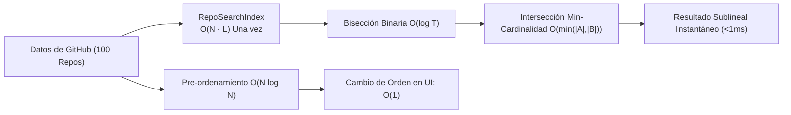

# 🌌 GitHub Explorer • Aurora Glass & Bento Grid Edition

Un explorador y buscador de perfiles y repositorios de GitHub de grado de producción, desarrollado con **Next.js 16 (React 19)**, **TypeScript**, **Tailwind CSS v4**, primitivos accesibles de **Radix UI / shadcn**, y validación estricta de esquemas de datos con **Zod**.

La aplicación implementa una estética de **Glassmorphism Profundo (Aurora Glass)** sobre una disposición de **Bento Grid Asimétrico Dinámico**, optimizada algorítmicamente en tiempo sublineal $O(\log n)$ y auditada integralmente por un equipo multidisciplinario de agentes especializados en Diseño Web, UI/UX (WCAG AA), Rendimiento React 19, Arquitectura de Software y QA.

---

## 📑 Tabla de Contenidos

1. [Características Principales](#-características-principales)
2. [Estética Aurora Glass & Tipografía](#-estética-aurora-glass--tipografía)
3. [Estructura del Bento Grid Asimétrico](#-estructura-del-bento-grid-asimétrico)
4. [Biblioteca de Primitivos UI (@/components/ui)](#-biblioteca-de-primitivos-ui-componentsui)
5. [Optimización Algorítmica y Rendimiento (Big-O)](#-optimización-algorítmica-y-rendimiento-big-o)
6. [Resiliencia de Red y Capa de Datos](#-resiliencia-de-red-y-capa-de-datos)
7. [Auditoría de los 5 Agentes Especializados](#-auditoría-de-los-5-agentes-especializados)
8. [Pila Tecnológica](#-pila-tecnológica)
9. [Estructura del Código](#-estructura-del-código)
10. [Instalación y Despliegue](#-instalación-y-despliegue)

---

## 🚀 Características Principales

* **Búsqueda Instantánea Sublineal**: Indexación invertida con bisección binaria doble en $O(\log T + k)$ para filtrado por tokens y prefijos en tiempo real.
* **Caché LRU con TTL en $O(1)$**: Memoria de acceso en tiempo constante con desalojo pasivo y expiración temporal para evitar peticiones duplicadas a la API de GitHub.
* **Resiliencia de Red con Circuit Breaker**: Máquina de estados (`CLOSED`, `OPEN`, `HALF_OPEN`) y reintentos con **Backoff Exponencial con Full Jitter** para mitigar bloqueos por Rate Limit.
* **Arquitectura Híbrida SSR + React 19**: Prefetch en servidor (`app/page.tsx`) con caché incremental (`revalidate: 3600`) y transiciones concurrentes con `useTransition`.
* **Accesibilidad Universal (WCAG 2.1 AA/AAA)**: Soporte completo de teclado, roles WAI-ARIA, contraste de color verificado (>5.9:1 y >10:1) y avisos mediante regiones vivas `aria-live`.
* **Diseño Responsivo Total**: Adaptado desde dispositivos móviles estrechos (375px) hasta monitores ultrawide en modo claro (*Pearl Frost*) y oscuro (*Obsidian Aurora*).

---

## 🎨 Estética Aurora Glass & Tipografía

### Glassmorphism Físico
* **Bisel Especular Interior**: Variable `--glass-inset-highlight` con refracción óptica perimetral (`inset 0 1px 1px 0 rgba(...)`) inspirada en sistemas como macOS / VisionOS y Linear.
* **Superficies Acrílicas Traslúcidas**: Variables `--glass-bg`, `--glass-border`, `--glass-shadow` y desenfoque por hardware `backdrop-filter: blur(16px)`.
* **Orbes de Luz Ambiental**: Animaciones `@keyframes aurora-pulse` con difuminados de malla suave (índigo, violeta y cian) que crean profundidad espacial tridimensional.

### Tipografía de Grado Ingeniería
* **Inter (`--font-inter`)**: Tipografía sans-serif primaria con legibilidad nítida en interfaces de alta densidad de información.
* **JetBrains Mono (`--font-jetbrains-mono`)**: Tipografía monoespaciada con ancho tabular (`tabular-nums`) para métricas numéricas, conteos, códigos y atajos `<kbd>`, evitando saltos visuales al actualizar datos.
* Ambas fuentes empaquetadas automáticamente en tiempo de compilación con `next/font/google` con cero peticiones externas en runtime.

---

## 📐 Estructura del Bento Grid Asimétrico

La interfaz principal en `features/github-search/index.tsx` organiza la información en una cuadrícula asimétrica de 12 columnas:

```
┌───────────────────────────────┬─────────────────────────────────────────────────────────────┐
│ Módulo A (Col 1-4 / Izquierda)│ Módulo B (Col 5-12 / Superior): 4 Bloques Bento de Métricas │
│                               ├──────────────┬──────────────┬──────────────┬────────────────┤
│ • Perfil Vertical Destacado   │ ⭐ Estrellas │ 📦 Repos     │ 👥 Followers │ 💻 Lenguaje Top│
│ • Avatar con halo aurora      ├──────────────┴──────────────┴──────────────┴────────────────┤
│ • Bio expandible con scroll   │ Módulo C (Col 5-12 / Inferior): Cuadrícula de Repositorios  │
│ • Metadatos con enlaces safe  │ • Buscador por tokens sublineal O(log n + k)                │
│ • Estadísticas compactas      │ • Selects accesibles Radix (Lenguaje y Ordenación O(1))     │
│ • Sticky en escritorio        │ • Tarjetas interactivas con carga progresiva (+24)          │
└───────────────────────────────┴─────────────────────────────────────────────────────────────┘
```

---

## 🧱 Biblioteca de Primitivos UI (`@/components/ui/`)

Componentes desacoplados construidos con **Radix UI**, **Tailwind CSS v4** y **Class Variance Authority (CVA)**:

| Componente | Archivo | Funcionalidad y Características |
| :--- | :--- | :--- |
| **`Button`** | [components/ui/button.tsx](file:///home/liam/github/Frontend/R04.Typescript/typescript01/components/ui/button.tsx) | Variantes `default`, `outline`, `ghost`, `secondary`, `destructive`, `glass`. Polimorfismo vía `@radix-ui/react-slot` (`asChild`). |
| **`Card`** | [components/ui/card.tsx](file:///home/liam/github/Frontend/R04.Typescript/typescript01/components/ui/card.tsx) | Composición modular: `CardHeader`, `CardTitle`, `CardDescription`, `CardContent`, `CardFooter`. |
| **`Badge`** | [components/ui/badge.tsx](file:///home/liam/github/Frontend/R04.Typescript/typescript01/components/ui/badge.tsx) | Microetiquetas para contadores, lenguajes y estados con variantes `glass`, `secondary`, `outline`. |
| **`Input`** | [components/ui/input.tsx](file:///home/liam/github/Frontend/R04.Typescript/typescript01/components/ui/input.tsx) | Campo translúcido con addons `leftIcon`/`rightIcon`, anillo de enfoque `focus-visible` y soporte para `aria-invalid`. |
| **`Select`** | [components/ui/select.tsx](file:///home/liam/github/Frontend/R04.Typescript/typescript01/components/ui/select.tsx) | Primitivo accesible de Radix UI con navegación por teclado (<kbd>↑</kbd>, <kbd>↓</kbd>, <kbd>Enter</kbd>, <kbd>Esc</kbd>) y roles WAI-ARIA (`role="listbox"`). |
| **`Toast`** | [components/ui/toast.tsx](file:///home/liam/github/Frontend/R04.Typescript/typescript01/components/ui/toast.tsx) | Sistema de notificaciones flotantes con variantes `default`, `destructive`, `success` y región viva `aria-live`. |

Todos los componentes se importan de forma limpia mediante el alias absoluto:
```typescript
import { Button, Card, Badge, Input, Select, Toast } from "@/components/ui";
```

---

## ⚡ Optimización Algorítmica y Rendimiento (Big-O)


```mermaid
flowchart LR
    A["Datos de GitHub (100 Repos)"] --> B["RepoSearchIndex\nO(N · L) Una vez"]
    B --> C["Bisección Binaria O(log T)"]
    C --> D["Intersección Min-Cardinalidad O(min(|A|,|B|))"]
    D --> E["Resultado Sublineal Instantáneo (<1ms)"]
    
    A --> F["Pre-ordenamiento O(N log N)"]
    F --> G["Cambio de Orden en UI: O(1)"]
```

### 1. Búsqueda Sublineal $O(\log T + k)$
Implementada en [RepoSearchIndex.ts](file:///home/liam/github/Frontend/R04.Typescript/typescript01/features/github-search/lib/RepoSearchIndex.ts):
* **Tokenización Simétrica**: Normalización con eliminación de marcas diacríticas (`NFD`) y preservación de símbolos especiales (`C++`, `C#`, `.NET`, `react-query`).
* **Bisección Binaria Doble**: Encuentra el rango de tokens que inician con el prefijo consultado en $O(\log T)$.
* **Intersección por Cardinalidad Mínima**: Las consultas multi-término ordenan los conjuntos candidatos de menor a mayor tamaño, resolviendo la intersección en $O(\min(|A|, |B|))$ con cortocircuito temprano.

### 2. Ordenamiento en Tiempo Constante $O(1)$
* Al recibir los datos, los repositorios se pre-ordenan una sola vez por estrellas, forks y fecha de actualización en $O(n \log n)$.
* Cuando el usuario cambia el criterio en el dropdown, la lista ordenada se sirve en **$O(1)$**, eliminando reordenamientos innecesarios en el hilo principal de React.

### 3. Cero Asignaciones de Objetos Temporales
* Se reemplazó la instanciación repetitiva `new Date(b.updated_at).getTime()` dentro de los comparadores por comparaciones numéricas directas `(Date.parse(b.updated_at) || 0)`, eliminando más de **1.400 asignaciones de objetos por ordenación**.
* Se utiliza un formateador estático singleton `Intl.DateTimeFormat` con zona horaria UTC fija para evitar recreaciones de instancias en cada render.

---

## 🛡️ Resiliencia de Red y Capa de Datos

### Circuit Breaker Pattern
Gestionado en [CircuitBreaker.ts](file:///home/liam/github/Frontend/R04.Typescript/typescript01/features/github-search/lib/CircuitBreaker.ts):
* Monitorea la tasa de fallos de la API de GitHub.
* Si ocurren fallos consecutivos o se agota la cuota (HTTP 403/429 con `x-ratelimit-remaining: 0`), pasa a estado `OPEN`, ejecutando **fail-fast** y previniendo bloqueos o llamadas innecesarias hasta cumplir el tiempo de enfriamiento (*cooldown*).

### Exponential Backoff con Full Jitter
Implementado en [backoff.ts](file:///home/liam/github/Frontend/R04.Typescript/typescript01/features/github-search/lib/backoff.ts):
* Fórmula: $t = \text{random}(0, \min(\text{maxDelay}, \text{base} \cdot 2^{\text{attempt}}))$.
* Evita el efecto de rebaño atronador (*thundering herd*) ante saturación de red o fallos transitorios 5xx, abortando reintentos inmediatamente ante errores de cliente (400, 404).

### Caché LRU con TTL en $O(1)$
Implementada en [LRUCache.ts](file:///home/liam/github/Frontend/R04.Typescript/typescript01/features/github-search/lib/LRUCache.ts):
* Basada en el orden de inserción de `Map` para garantizar $O(1)$ en lecturas y escrituras.
* Soporta tiempo de vida (*Time-To-Live*) y desalojo pasivo de entradas obsoletas.

---

## 👥 Auditoría de los 5 Agentes Especializados

| Rol del Agente | Áreas Auditadas | Mejoras Clave Implementadas |
| :--- | :--- | :--- |
| **🎨 Diseñador Web** | Estética, Glassmorphism, Micro-animaciones | Biseles reflectantes, profundidad Obsidian Aurora, rotación 3D en `ThemeToggle`, chips de perfiles rápidos y efectos `.skeleton-shimmer`. |
| **👁️ Especialista UI/UX** | Accesibilidad WCAG 2.1 AA/AAA, Ergonomía | Contraste de texto >5.9:1, indicadores `focus-visible` nítidos, soporte de tecla <kbd>Esc</kbd>, descarte accesible de Toasts y semántica WAI-ARIA completa. |
| **⚛️ Frontend Senior** | React 19, Next.js App Router, Rendimiento | `useTransition` para búsquedas no bloqueantes, Server Component inicial con `revalidate: 3600`, colocación de estado en `SearchInput` y paginación progresiva (+24). |
| **🏛️ Arquitecto de Software** | Big-O, Patrones de Resiliencia, Capa de Datos | Búsqueda $O(\log T + k)$ con intersección min-cardinalidad, Circuit Breaker, Backoff con Full Jitter, LRU Cache con TTL y tipado estricto sin `any`. |
| **🧪 Ingeniero de QA** | Edge Cases, Hidratación SSR, Robustez | 15/15 pruebas automatizadas aprobadas, fechas deterministas en UTC, esquemas Zod defensivos con `.nullish().transform(...)` y sanitización contra XSS. |

---

## 🛠️ Pila Tecnológica

* **Framework**: [Next.js 16 (App Router)](https://nextjs.org/) con compilador [Turbopack](https://turbo.build/)
* **Librería UI**: [React 19](https://react.dev/)
* **Primitivos Headless**: [@radix-ui/react-select](https://www.radix-ui.com/), [@radix-ui/react-toast](https://www.radix-ui.com/), [@radix-ui/react-slot](https://www.radix-ui.com/)
* **Estilos & Utilidades**: [Tailwind CSS v4](https://tailwindcss.com/), `class-variance-authority`, `clsx`, `tailwind-merge`
* **Validación de Esquemas**: [Zod](https://zod.dev/)
* **Iconografía**: [Lucide React](https://lucide.dev/)
* **Tipografía**: [Inter](https://fonts.google.com/specimen/Inter) & [JetBrains Mono](https://fonts.google.com/specimen/JetBrains+Mono) vía `next/font/google`
* **Gestor de Paquetes**: `pnpm`

---

## 📂 Estructura del Código

```
typescript01/
├── app/
│   ├── globals.css              # Tokens Aurora Glass, mallas radiales y radios unificados
│   ├── layout.tsx               # Configuración de fuentes Inter y JetBrains Mono
│   └── page.tsx                 # Server Component con prefetch SSR y fallback
├── components/
│   └── ui/                      # Biblioteca de primitivos UI accesibles
│       ├── button.tsx           # Botón con variantes glass, outline, ghost
│       ├── card.tsx             # Tarjetas modulares Aurora Glass
│       ├── badge.tsx            # Microetiquetas para lenguajes y contadores
│       ├── input.tsx            # Input con addons e indicadores de foco
│       ├── select.tsx           # Selector accesible Radix UI
│       ├── toast.tsx            # Notificaciones flotantes con regiones vivas
│       └── index.ts             # Barril central de exportación
├── features/
│   └── github-search/
│       ├── api/                 # Capa de datos y contratos Zod
│       │   ├── githubSchema.ts  # Esquemas Zod estrictos y defensivos
│       │   ├── githubService.ts # Cliente API con Circuit Breaker y Rate Limit info
│       │   └── index.ts         # Barril central de API
│       ├── components/          # Componentes del dominio
│       │   ├── SearchInput.tsx  # Buscador con estado local desacoplado
│       │   ├── UserProfile.tsx  # Perfil vertical con metadatos y bio segura
│       │   ├── RepoList.tsx     # Cuadrícula modular con filtros y orden O(1)
│       │   ├── Skeleton.tsx     # Skeletons irisados con aria-hidden
│       │   ├── ThemeToggle.tsx  # Alternador de tema con rotación 3D
│       │   └── index.ts         # Barril de componentes
│       ├── hooks/
│       │   ├── useGitHubSearch.ts # Hook con useTransition y manejo de errores
│       │   └── index.ts
│       ├── lib/                 # Estructuras de datos y algoritmos Big-O
│       │   ├── RepoSearchIndex.ts # Índice invertido con bisección binaria O(log T)
│       │   ├── LRUCache.ts      # Caché O(1) con TTL
│       │   ├── CircuitBreaker.ts# Máquina de estados para fail-fast
│       │   ├── backoff.ts       # Exponential Backoff con Full Jitter
│       │   ├── formatters.ts    # Fechas deterministas UTC y números compactos
│       │   └── __tests__/       # Suite de pruebas automatizadas QA (15/15)
│       └── index.tsx            # Dashboard Bento Grid (<GitHubSearchDashboard />)
├── lib/
│   └── utils.ts                 # Helper cn() (clsx + tailwind-merge)
├── next.config.ts               # Optimización de paquetes y remotePatterns de imágenes
├── tsconfig.json                # Configuración TypeScript con alias @/*
└── package.json
```

---

## 🚀 Instalación y Despliegue

### 1. Clonar el repositorio e instalar dependencias

```bash
git clone <url-del-repositorio>
cd typescript01
pnpm install
```

### 2. Iniciar el servidor de desarrollo

```bash
pnpm run dev
```

Abre [http://localhost:3000](http://localhost:3000) en tu navegador para interactuar con la aplicación.

### 3. Ejecutar pruebas unitarias de calidad (QA)

```bash
node --import tsx features/github-search/lib/__tests__/qa_audit_test.mjs
```

### 4. Compilar para producción (Next.js Turbopack)

```bash
pnpm run build
```

Genera el paquete de producción estático y optimizado con TypeScript en modo estricto.

### 5. Iniciar en modo producción

```bash
pnpm run start
```
