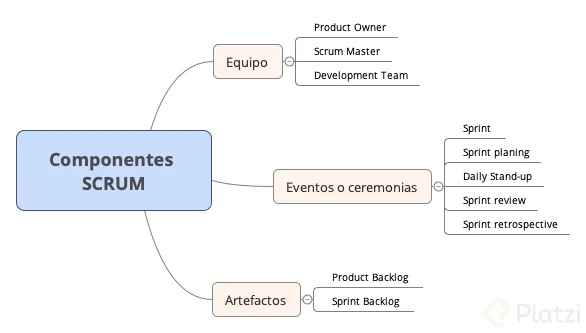

Certificaicon gratis

https://certiprof.com/pages/scrum-foundation-professional-certificate-sfpc-v2020-spanish

pdf de la guia SCRUM

https://scrumguides.org/docs/scrumguide/v2017/2017-Scrum-Guide-Spanish-European.pdf

https://ignacio-velasquez.notion.site/SCRUM-79bedb969e914653ac3742ab0a2dd445

https://agilemanifesto.org/iso/es/manifesto.html

## 1-¿Qué es una metodología ágil?

-   un producto cambio por el mercado cambia.
-   el cambio debe responder a la nececiedade del mercado
-   desarrollo tradicional vs desarrollo agil
-   desarrollo traicional : grupo de trabajo grande
-   desarrollo agil :
    -   grupo de trabajo pequeño (3-9 personas) y
    -   entregable en tiempo corto.
    -   Lista de requimientos en pequeño en un iteracion (2 semanas)
    -   En cada entrega pequeños cambios por parte del cliente .
-

## 12 principios agiles

son 4 elementos

-   individuos e interaciones
-   software funcionando
-   colaboracion con el cliente : crear confiaza con el cliente
-   respuesta ante el cambio : buena clara al cambio

12 principios

1. Satisfacción al cliente: Nuestra mayor prioridad es satisfacer al cliente mediante la entrega temprana y continua de software con valor.

2. Cambios: Aceptamos que los requisitos cambien, incluso en etapas tardías del desarrollo. Los procesos Ágiles aprovechan el cambio para proporcionar ventaja competitiva al cliente.

3. Software funcional: Entregamos software funcional frecuentemente, entre dos semanas y dos meses, con preferencia al periodo de tiempo más corto posible.

4. Colaboradores: Los responsables de negocio y los desarrolladores trabajamos juntos de forma cotidiana durante todo el proyecto.

5. Individuos motivados: Los proyectos se desarrollan en torno a individuos motivados. Hay que darles el entorno y el apoyo que necesitan, y confiarles la ejecución del trabajo.

6. Comunicación cara a cara: El método más eficiente y efectivo de comunicar información al equipo de desarrollo y entre sus miembros es la conversación cara a cara.

7. Progreso: El software funcionando es la medida principal de progreso.

8. Desarrollo sostenible: Los procesos Ágiles promueven el desarrollo sostenible. Los promotores, desarrolladores y usuarios debemos ser capaces de mantener un ritmo constante de forma indefinida.

9. Mejora continua: La atención continua a la excelencia técnica y al buen diseño mejora la Agilidad.

10. Simplicidad: La simplicidad, o el arte de maximizar la cantidad de trabajo no realizado, es esencial.

11. Auto-organización: Las mejores arquitecturas, requisitos y diseños emergen de equipos auto-organizados.

12. Auto- aprendizaje: A intervalos regulares el equipo reflexiona sobre cómo ser más efectivo para a continuación ajustar y perfeccionar su comportamiento en consecuencia.

## 3- Que es Scrum

-   todo equipo colabora para conseguir
-   marco de trabajo para resolver problema (software,bancario,cotiano)
-   equipo pequeño adaptivo y flexible (3-9 personas)
-   teoria de scrum : control de proceso empirica (experencias)
-   Pilares

    -   Transparencia
    -   Inspeccion : revision de artefactos(observar requerimeinto si esta bien definido)
    -   Adaptacion : capacidad de equipo de entender el cambio y implementar rapidamente.

-   valores de scrum
    -   Compromisos : el equipo se enfoca en el objectivo
    -   Coraje : el equipo acepta el complejo de la tarea y cumplir en el sprint
    -   Enfoque : el equipo cumple el requerimiento
    -   Apertura : abierto a escuchar a otros
    -   Respeto : entre los miembros respecta la solucion de otra peronas funciona

## 4- Compoennte de Scrum

-   Equipo Scrum : roles

    -   Product Owner : Represanta al cliente
    -   Scrum Master : ayuda a la implementacion
    -   Development Team : hacen el trabajo

-   Evento de Scrum :

    -   Sprint : periodo de tiempo corto
    -   Sprint Planning: reunion donde se define lo que se va a trabajar
    -   Daily stand-up : como va el proceso
    -   Spreing review : al finalizar el sprint se verifica si se logro
    -   Spring retrospective : mejora continua

-   Artefacto de Scrum :

    -   Todos tiene acceso a los artefacto (equipo , clinete , usuarios )
    -   Product Backlog :Requerimiento Funcional (lista) del producto (el usuario puede enviar correo)
    -   Sprint Backlog:Lista de producto asiganos a diferente sprint .

---

Componentes de Scrum

1 Equipo de Scrum

El equipo de Scrum es auto organizado y multifuncional.

    a) Dueño del producto (Product Owner). Responsable de maximizar el valor del producto
    b) Scrum Master. Responsable de promover y apoyar Scrum.
    c) Equipo de desarrollo (Development Team). Profesionales que realizan el trabajo de entregar un incremento de producto “Terminado”.

2 Eventos de Scrum (Ceremonias)

En Scrum existen eventos predefinidos con el fin de crear regularidad y minimizar la necesidad de reuniones no definidas en Scrum.

    a) Sprint. Es el corazón de Scrum donde se crea un incremento del producto.
    b) Planificación de Sprint (Sprint planning). Ceremonia para definir qué se hará durante el sprint.
    c) Scrum Diario (Daily stan-up). Reunión diaria de todo el equipo de desarrollo.
    d) Revisión de Sprint (Sprint review). Es donde se muestra el incremento desarrollado durante el sprint.
    e) Retrospectiva de Sprint (Sprint retrospective). Oportunidad para aplicar mejora continua.

3 Artefactos de Scrum

Los artefactos de Scrum representan trabajo o valor en diversas formas que son útiles para proporcionar transparencia y oportunidad para la inspección y adaptación. Son aquellos elementos que definen que quiere el cliente, pero son visibles para todas las personas que trabajan en el proyecto.

    a) Lista del producto (Product Backlog). Es una lista ordenada de todo lo que se conoce que es necesario en el producto.
    b) Lista de pendientes del Sprint (Sprint Backlog). Elementos de la lista de producto seleccionados para el sprint.

## 5- Development Team

-   Son el equipo scrum y primer elemento del scrum
-   Comformado por :

    -   Product Owner: Arq.
    -   Scrum master: Ing.
    -   Equpo de desarrollo : Albañiles

-   iterativa(en el sprint)
-   incremental (entrega de trabajos en partes)
-

## 6 - no hay videos

## 7 - Qué hace el Product Owner o Dueño del Producto

## 11 - ¿Cómo crear Historias de Usuario?

## 12 - Cómo estimar Historias de Usuario

Para poder estimar historias de usuario tenemos que tener en cuenta:

La complejidad de la historia, funcionalidad de la actividad
Cantidad de trabajo requerido, tamaño de la actividad
Conocimientos necesarios, aprendizaje para realizar la actividad
Incertidumbre, factores externos que no controlamos
El estimado lo vamos a tomar como puntos, los puntos no son horas de trabajo, no commits, etc es un estimado empírico en base a la experiencia del proyecto.

Poker de planeación, esta herramienta nos va a servir para estimar las historias de usuarios. Podemos usar diferentes escalas, ejemplo:

1, 2, 3, 5, 8, 13 ... infinito e incertidumbre
1, 2, 4, 8, 16, 32 ...
La idea de no usar números consecutivos es para reducir las discusiones

Al final del sprint vamos a tener el valor total de puntos y eso nos va a dar el valor de velocidad del equipo.

La velocidad es el total de puntos completados por el equipo durante las historias de usuario.

La capacidad es el total de historias de usuario que se pueden completar en un sprint futuro.

Entonces básicamente el primer sprint sirve para medir la velocidad del equipo y en base a este se van a poder estimar mejor los siguientes sprints.

## 13 ¿Cómo empezar? Prioridades y Backlog del Sprint

El backlog del sprint va a ser un subconjunto de elementos de la lista del producto y estas historias de usuario son las que vamos a trabajar y los objetivos que queremos cumplir.

\*Etapas intermedias:

Historias de usuario
Historias que hemos decidido trabajar
Historias que están en progreso
Historias que se van a empezar a probar
Historias terminadas
Trello es una buena herramienta para darle seguimiento a las actividades. Aqui les dejo un link del tablero que yo uso https://trello.com/b/2SFC7g8G/scrum-ejemplo

Lista de pendientes del sprint debe estar lo suficientemente detallado para que el equipo sea capaz de comprenderlo en los daily stand-ups

El dueño del backlog del sprint es el equipo de desarrollo, y ellos tienen control sobre esta lista y están en su derecho de rechazar otras historias. Sin embargo el Product owner podrá dialogar con el equipo para bajar la prioridad o eliminar historias de usuarios

Como se define las prioridades:

Valor para el cliente, que historias generan más valor al producto
Urgencia, cuando algo tiene una fecha limite
Riesgo / Oportunidad, definir el impacto que una historia puede tener sobre otras
Esfuerzo que tanto trabajo le va a tomar al equipo desarrollar la historia

## 14 Cómo medir el avance de un proyecto Scrum

Relaciono gráficamente la diferencia entre:

-   burn down chart :
    -   el objetivo es terminar los puntos y llegar a tener 0 puntos "pendientes" de historias de usuario en los días de sprint.
-   burn up chart :
    -   el objetivo es cumplir los puntos en su totalidad acumulándolos a lo largo de en los días de sprint

## 15 Qué es el Sprint en un proyecto Scrum

El corazón de Scrum es el sprint

El sprint es un periodo determinado, normalmente dura de 1 a 4 semanas y siempre sera el mismo periodo.

El ritmo del sprint:

Planeación del sprint, que se va a trabajar
Scrum diario, reunión para discutir el progreso
Trabajo de desarrollo, que va ocurriendo todos los días
Revisión del sprint, aquí vemos si se cumplen o no los objetivos
Retrospectiva del sprint, que se puede mejorar
Todos los sprints deben de tener un objetivo claro y el equipo de desarrollo lo debe saber porque lo esta haciendo

Si los objetivos quedan obsoletos el product owner puede cancelar el sprint y esto rara vez sucede

## 16

## 17

## 18

## 19

## 20

## 21

# Respuestas

1.Es una diferencia de SCRUM con respecto al desarrollo tradicional:

Trabajar pequeños lotes de requerimientos.

2. (clase 2/21)
   Es la principal medida de progreso en un proyecto desarrollado con metodologías ágiles:

Historias completas.--->[Falso]

Repasar 3.
No es un valor de SCRUM.

Transparencia 4.
¿Cuál de las siguientes opciones NO es una ceremonia de SCRUM?

Restrospectiva Historias completas.--->[Falso]
Repasar

5.  ¿Quién es el dueño del backlog?
    Product Owner 6.
    ¿El Product Owner debe priorizar las historias del backlog?
    Sí
    7.Una de las principales funciones del Scrum Master es:

Eliminar impedimentos en el proceso de desarrollo.

8.  En términos generales, no es parte del Equipo de Desarrollo:

El Product Owner

9.El proceso de desarrollo solo se puede comenzar una vez el backlog del producto está completo y definido al 100%
Falso

10.¿Quién puede agregar historias de usuario a los distintos backlogs?
Scrum Master .--->[Falso]
Rpta. Usuario / product owner
Repasar

11.¿Qué miden los puntos de las historias?
La cantidad de tiempo que tarda terminarla..--->[Falso]
Rpta. esfuerzo
Repasar

12.¿Quién define el contenido del backlog del sprint?
El product owner.--->[Falso]
rpta. Equipo de desarrollo
Repasar

13.¿Qué gráfico me ayudará a medir la cantidad de trabajo que puede completar mi equipo en un sprint?
Gráfica de flujo acumulado .--->[Falso]
Rpta. burn up
Repasar

14.¿Cuánto tiempo debe durar un sprint?
2 semanas .--->[Falso]
Repasar

15.¿En qué momento se realiza la planeación del sprint?
El primer día del sprint.

16. ¿Qué no debo mencionar en el daily stand-up?
    Problemas complejos en el código.

17. ¿Cuál es uno de los principales objetivos de la sesión para refinar historias?
    Tener una mejor visión del siguiente sprint.

18. Es un objetivo de las retrospectivas:

Impulsar la mejora continua.

19. ¿Quiénes deben participar en la reunión de Scrum of Scrums?
    Generalmente los Scrum Masters, pero podrían ser miembros del equipo de desarrollo, según el caso.

20. ¿Para qué es importante tener comunidades de práctica?
    Para promover estándares y mejores prácticas entre los distintos equipos.
